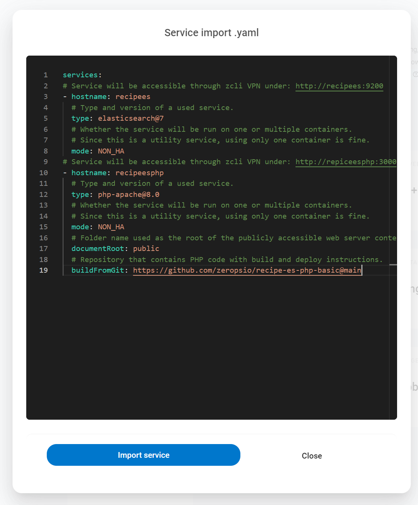

# ZEROPS RECIPES

The concept of pre-prepared skeletons demonstrates the way how to set up and use technologies Zerops is supporting.

## Recipe: Basic integration of Elasticsearch & PHP

Pre-prepared skeleton demonstrating the way how to set up and use PHP and [Elasticsearch](https://www.elastic.co/elasticsearch) in Zerops. The main focus is on the client [PHP SDK](https://www.elastic.co/guide/en/elasticsearch/client/php-api/current/index.html) (here, **v7.15** is used) configuration to connect the Elasticsearch service and show a simple example of how to insert a new document.

## Zerops import syntax

```yaml
services:
# Service will be accessible through zcli VPN under: http://recipees:9200
- hostname: recipees
  # Type and version of a used service.
  type: elasticsearch@7
  # Whether the service will be run on one or multiple containers.
  # Since this is a utility service, using only one container is fine.
  mode: NON_HA
# Service will be accessible through zcli VPN under: http://repiceesphp:3000
- hostname: recipeesphp
  # Type and version of a used service.
  type: php-apache@8.0
  # Whether the service will be run on one or multiple containers.
  # Since this is a utility service, using only one container is fine.
  mode: NON_HA
  # Folder name used as the root of the publicly accessible web server content.
  documentRoot: public
  # Repository that contains PHP code with build and deploy instructions.
  buildFromGit: https://github.com/zeropsio/recipe-es-php-basic@main
```

Copy & paste the import snippet above into the dialog of **Import service** functionality.



See the [Zerops documentation](https://docs.zerops.io/documentation/export-import/project-service-export-import.html) to understand how to use it.

## Using the recipe

1. Use the Zerops [importing](/documentation/export-import/project-service-export-import.html#how-to-export-import-a-project) functionality to import [both recipe services](#zerops-import-syntax) into your already existing Zerops project.

2. Wait till the moment when both services will be created and running.
